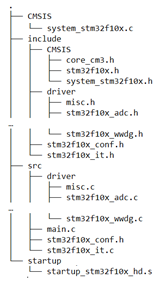

**How to create a Keil workspace from SPL?**

---STM32 F103 VC for example

Workspace is a space contains necessary files for a particular project, usually a folder. The document aims to provide a step by step method to create a workspace folder that can be a template for most STM32 F1XX projects.

**Navigator:**

[0. Pre-request:](#Pre_request)

[1. Initialize your workspace:](#Initialize_your_workspace)

[2. Setup your environment:](#Setup_your_environment)

[3. Setup your ST-Link:](#Setup_your_STLink)

[Appendix](#Appendix)

**0. Pre-request:**

`	`a. First, you need a Standard Peripheral Library (SPL) for your device. Go download from ST website!

`	`b. Of course you should complete Keil installation.

`	`c. There are some references you should have a look at…

`		`i. some notes

`		`ii. official docs

**1. Initialize your workspace:**

`	`a. build a workspace folder with following structures: (All the files can be found in SPL, just use Ctrl+F)

File structure. 

Hint: 1. “…” means all the files in the same directory

\2. startup\_stm32f10x\_hd.s has various version, we will use one locate in /3.5.0/STM32F10x\_StdPeriph\_Lib\_V3.5.0/Libraries/CMSIS/CM3/DeviceSupport/ST/STM32F10x/startup/

\3. When using stm32f103c8 or c6, we will use startup\_stm32f10x\_md.s (for c8) or startup\_stm32f10x\_ld.s (for c6)

`	`b. create a keil project located in the workspace folder.

Step 1: Create a project

Step 2: Name and locate your project

Step 3: choose a STM type that fit your device

Step 4: Just press OK

Step 5: Workspace after project creation. Check it out.

**2. Setup your environment:**

`	`a. Configure source groups: Source groups are where Keil finds source files(.c/.s)

Step 1: Let’s tell Keil where should it find sources to compile

Step 2: Rename source group by double click

Step 3: Click “Add Files…”, then add source files (.c/.s) to corresponding groups.

Hint: .s is assembly files

Step 4: Check the source groups are added as above (Don’t mind the blue block)

`	`b. configure “options for targets”

Step 1: Click “Options for target”

Step 2: Define preprocessor symbols and include paths

(STM32F10X\_HD,USE\_STDPERIPH\_DRIVER)

(STM32F10X\_LD,USE\_STDPERIPH\_DRIVER for C8)

(STM32F10X\_LD,USE\_STDPERIPH\_DRIVER for C6)

Step 2b: in this case, we should assign “include”, “include/driver” and “include/CMSIS”

Step 2c: Should end up like that

Step 3: choose MicroLib (so as to use printf)

Step 4: Choose the right debugger (ST-Link in this case)

Step 4b: be aware of Port (Down left), Choose Jtag or SW, 

Step 5: Try to compile it with some codes

(Example codes can be found below)

Step 6: Make it 0 Error and Warning

**c.** example: example can be arbitrary, but and is one

main.c:

#include "stm32f10x.h"  

` `void delay\_ms(u16 nms);  

` `int main(void)  

` `{  

`     `GPIO\_InitTypeDef GPIO\_InitStructure;  

`     `RCC\_APB2PeriphClockCmd( RCC\_APB2Periph\_GPIOE, ENABLE);  

`     `GPIO\_InitStructure.GPIO\_Pin=GPIO\_Pin\_5;  

`     `GPIO\_InitStructure.GPIO\_Mode=GPIO\_Mode\_Out\_PP;  

`     `GPIO\_InitStructure.GPIO\_Speed=GPIO\_Speed\_50MHz;  

`     `GPIO\_Init(GPIOE, &GPIO\_InitStructure);  

`     `while(1){  

`         `GPIO\_SetBits(GPIOE,GPIO\_Pin\_5);  

`         `delay\_ms(1000);  

`         `GPIO\_ResetBits(GPIOE,GPIO\_Pin\_5);  

`         `delay\_ms(1000);  

`     `}  

` `}  

` `void delay\_ms(u16 nms)  

` `{  

`  `u32 temp;  

`  `SysTick->LOAD = 9000\*nms;  

`  `SysTick->VAL=0X00;//clear the tickle  

`  `SysTick->CTRL=0X01;//enable  

`  `do  

`  `{  

`  `temp=SysTick->CTRL;//read the tickle  

`  `}while((temp&0x01)&&(!(temp&(1<<16))));//wait for the end  

`   `SysTick->CTRL=0x00; //close it  

`   `SysTick->VAL =0X00; //clear it  

` `}  

**3. Setup your ST-Link:**

In this case, you can use ST-Link V2 to help upload codes and debug. Follow below steps to help you use the ST-Link in Keil

\1. Click “Option for targets”, go to “debug” tag and choose the right debugger:

\2. Enter Settings

Make sure that the “port” is “SW” and the “Connect” is “with Pre-reset”.

Note that when clicking “Settings”, a dialog may jump out and help you to update the ST-Link driver. If it told you that ST-Link is in the wrong mode, please re-plugin your ST-Link and try again.

**Appendix:**

For switching to different STM32F103 type, you will need to do following steps:

Ex: from VC to C6 or C8

\1. Click “Option for targets”, go to “device” tag and change device to C6

\2. Go to C/C++ tag and change STM32F10X\_HD to STM32F10X\_LD (for C6) or STM32F10X\_MD (for C8)

\3. Go to /3.5.0/STM32F10x\_StdPeriph\_Lib\_V3.5.0/Libraries/CMSIS/CM3/DeviceSupport/ST/STM32F10x/startup/ 

to find startup\_stm32f10x\_ld.s (for c6, and startup\_stm32f10x\_md.s for c8) and copy one to /startup folder under your workspace.

\4. Rebuild and check.
