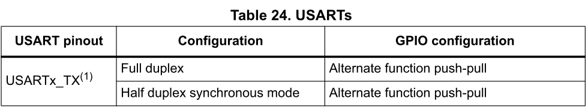

**How to create your own driver library?**

STM32 F103 VC for example

The section should give you a fairly general overview toward **how one learns to operate STM32 peripherals** from knowing nothing. We will start from previous section “How to create Keil workspace from SPL?” and try to build a USART1 driver. At the end of the section, I hope that readers can create a USART.h library of their own.

**0. Pre-request:**

I use STM32 F104 VC for this example, but it should be valid for all STM32 F103 variant. Of course some configuration in Keil should be changed. Besides, I use a USB-ttl converter for communicate between STM32 and PC.

Some terms: 

- ST: The company who made STM32 with some Arm cortex M3 IP.
- Peripherals: Usually additional parts in mcus that provide certain functions like USART/SPI/Timer….etc
- SPL: Standard Peripheral Library is provided by ST and aim to “abstractize” the operation of registers. That is, we don’t have to memorize and access those “annoying” registers, we just have to use API provided by SPL.

`	`A Keil workspace should be prepared. Also, get three of the following documents ready:

- RM0008 - Reference manual
- UM1061 - Description of STM32F2xx Standard Peripheral Library
- STM32 F103 Datasheet 

Note: Datasheet for High Density Device and Medium Density are different. Further, those documents should be right in the doc/Documents/.

ST also provide examples for most of the peripherals. It’s in:

STM32F10x\_StdPeriph\_Lib\_V3.5.0/Project/STM32F10x\_StdPeriph\_Examples

Those examples will be very helpful in comprehension with the usage of standard peripheral library.

Note: when it’s not just about USART…

Sometimes additional materials may be provided by ST or ARM. For example, if we want to make use of ADC, ST provides AN4195 which gives a clearer picture of using it.

More useful websites:

`	`<http://wiki.csie.ncku.edu.tw/embedded/USART>

`	`NCKU wiki

`	`<https://developer.arm.com/documentation/#sort=relevancy&f:@navigationhierarchiesproducts=[IP%20Products,Processors,Cortex-M,Cortex-M3>]

`	`Arm documents for Cortex M3

**1. Create new files for library in Keil:**

**a. open 2 new files**	

**b. you’ll find a new file is opened, try to write:**

#ifndef \_USART1\_H

#define \_USART1\_H

#endif

Note: These are preprocess commands, which will prevent your project from redefinition (and potentially other error).

If there are two files include this header in the same projects, the first will define a macro called \_USART1\_H and process following codes (those before #endif). The second file will just ignore codes between #ifndef(if not defined) and #endif because \_USART1\_H has been defined at the first file. Thus, we won’t include the same file the second time.

<https://www.reddit.com/r/C_Programming/comments/a7h3yh/why_make_a_header_file_why_cant_we_just_include_c/>

**c. save the file in include/ directory**

**d. repeat step a and c, but save it in src/ and call it “USART1.c”**

**e. right click “src” in the Project bar and “Add Existing Files to Group ‘src’”**

**f. add the file you just create**

**2. Tips for Studing Official Documents:**

Most of the peripheral operations require following step.

- Brief knowledge of that peripheral
- Understanding of peripheral configurations
- Be sure of what GPIO should be used
- Check out SPL manual for coding instruction
- Implement it!

**a. Understanding of peripheral configurations**

The basic knowledge of USART can be seen in the [NCKU link](http://wiki.csie.ncku.edu.tw/embedded/USART) provided above. You should study through that link and reference manual chapter 27 then check if you realize following concepts:

What is:

- Baudrate
- Stop Bit
- WordLength
- Parity

How can one:

- send a data out
- access received data

Note: There are more for you to know about USART. However, it is important for someone new to USART and STM32 to catch up the most important stuffs when reading quite an amount of information in those documents I provide.

It is very welcome for you to study further in USART(and any other peripheral) on STM32 and implement it. There are many more functionality that we have not made use of in STM32 USART peripheral, like multiprocessor communication…etc.

**b. Be sure of what GPIO should be used**

Please check out Chapter 9. You should find following tables:

With both table, we will choose PA9 and PA 10 for USART1 TX/RX

**c. Check out SPL manual for coding instruction:**

In UM1601, you will find following instruction in chapter 6.

There are a few focal points you should learn from above:

- Start peripheral clock first. We will use GPIO and USART peripheral.
- Configure GPIO peripheral
- Configure USART peripheral with specifying Baudrate, Wordlength, Stopbit …etc
- Start (not configure) USART

Note: Most procedures to start up a peripheral are similar. Peripheral clock should be started and GPIO should be configured. Then you must choose correct configuration for the peripheral.

**3. Implementation:**

**a. structure:**

There will be 3 files: main.c, USART1.h an USART1.c. The main.c have your main() function, and will include your library, which is a header called USART1.h and there are functions claimed in USART1.h. However, your function will be implemented in USART1.c, and we will also include USART1.h in USART1.c.

By doing so, USART1.h will be an interface that only hold the name of function that is inside the library. If we want to change how we implement those functions, we just have to recompile USART1.c. Likewise, if we want to change how we use those functions in main, we just have to recompile main.c. Moreover, we can easily move the library to other projects independently.

Note: Because we want to use SPL, so we should include SPL header. That should be done with “#include “stm32f10x.h” in USART1.h file”

**b. What should it look like?**

Below are a simple and workable USART1 library. If there exist some problems, you should tell us and we’ll try to fix it ASAP.

Note: You should try to implement one first before check out below section.

#ifndef \_USART1\_H

#define \_USART1\_H

#include "stm32f10x.h"

void USART1\_config(void);

int USART1\_PutChar(int ch);

int usart\_receive(void);

void USART1\_PutString(char\* str, int size);

#endif

USART.h

#include "usart1.h"

void USART1\_config(void){

`	`GPIO\_InitTypeDef GPIO\_InitStructure;

`	`USART\_InitTypeDef USART\_InitStructure;

`	`/\*start up the clock\*/

`	`RCC\_APB2PeriphClockCmd(RCC\_APB2Periph\_USART1 | RCC\_APB2Periph\_GPIOA, ENABLE);

`	`/\*config PA9(Tx) & PA10(Rx)\*/

`	`GPIO\_InitStructure.GPIO\_Pin = GPIO\_Pin\_9;

`	`GPIO\_InitStructure.GPIO\_Mode = GPIO\_Mode\_AF\_PP;

`	`GPIO\_InitStructure.GPIO\_Speed = GPIO\_Speed\_50MHz;

`	`GPIO\_Init(GPIOA, &GPIO\_InitStructure);

`	`GPIO\_InitStructure.GPIO\_Pin = GPIO\_Pin\_10;

`	`GPIO\_InitStructure.GPIO\_Mode = GPIO\_Mode\_IN\_FLOATING;

`	`GPIO\_Init(GPIOA, &GPIO\_InitStructure);

`	`/\*config usart1\*/

`	`USART\_InitStructure.USART\_BaudRate = 115200;

`	`USART\_InitStructure.USART\_WordLength = USART\_WordLength\_8b;

`	`USART\_InitStructure.USART\_StopBits = USART\_StopBits\_1;

`	`USART\_InitStructure.USART\_Parity = USART\_Parity\_No;

`	`USART\_InitStructure.USART\_HardwareFlowControl = USART\_HardwareFlowControl\_None;

`	`USART\_InitStructure.USART\_Mode = USART\_Mode\_Rx| USART\_Mode\_Tx; 

`	`USART\_Init(USART1, &USART\_InitStructure);

`	`/\*start usart1 with the configuration we just "init"\*/

`	`USART\_Cmd(USART1,ENABLE);

}

USART1.c

int USART1\_PutChar(int ch){

`	`USART\_SendData(USART1, (uint8\_t) ch);

`	`//wait for sending data

`	`while(USART\_GetFlagStatus(USART1,USART\_FLAG\_TC) == RESET);

`	`return ch;

}

void USART1\_PutString(char\* str, int size){

`	`for(int i=0;i<size;i++){

`		`USART1\_PutChar((int) str[i]);

`	`}

}

int usart\_receive(void){

`	`//wait for receiving data

`	`while(USART\_GetFlagStatus(USART1,USART\_FLAG\_TC) == RESET);

`	`return (int) USART\_ReceiveData(USART1);

}

Continue:

#include "usart1.h"

int main(void)

{

`	`USART1\_config();

`	`while(1){

`		`USART1\_PutString(“Hello darkness \r\n”,17);

}

}

Main.c

**Appendix:**

**How to collect USART data from STM32 in PC?**

We use Putty~

<https://www.chiark.greenend.org.uk/~sgtatham/putty/latest.html>

Install and open putty, we should check out the com port of our USB device

Right click “START” in Win10, choose “Device Manager”

So it is COM9

Putty should be like that, press open
